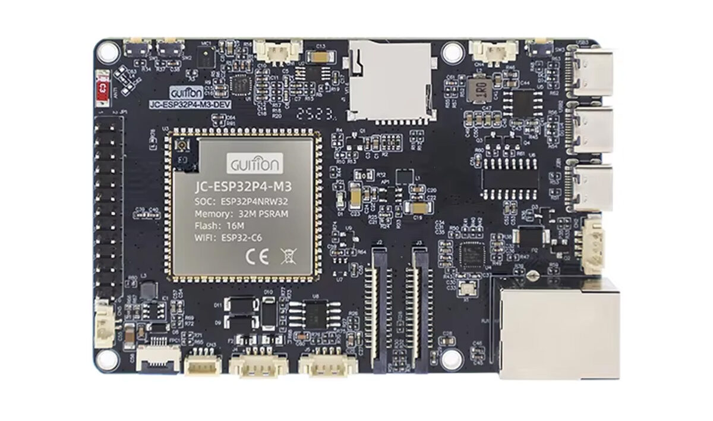

# ESP32-P4 Voice Assistant (ESP-IDF, JC-ESP32P4-M3-DEV)

Local voice assistant firmware for Home Assistant, built natively on ESP-IDF for the ESP32-P4 platform. Uses WakeNet9 wake-word detection and integrates with the Home Assistant Assist pipeline over WebSocket, plus MQTT auto-discovery for controls and status.

## ✅ Project Status

- Status: functional (wake -> VAD -> HA STT/intent -> TTS playback -> auto-resume wake word)
- ESP-IDF: v5.5
- Target board: `JC-ESP32P4-M3-DEV` (ESP32-P4 + ESP32-C6 Wi-Fi coprocessor over SDIO)

## ✨ Highlights

- Wake word: ESP-SR WakeNet9 model `wn9_hiesp` ("Hi ESP"), 16 kHz mono; threshold (`wwd_detection_threshold`) adjustable at runtime (0.50-0.95).
- Home Assistant Assist pipeline via WebSocket: STT/intent/TTS events + audio streaming.
- Local timer fallback: if HA does not support timers (or intent parsing fails), the firmware tries to extract duration from STT text (Croatian keywords like "timer/tajmer/odbrojavanje").
- Local MP3 player from SD card; voice pipeline pauses/stops WWD during music to avoid codec/I2S conflicts.
- MQTT Home Assistant Discovery: sensors + controls (WWD, AGC, LED, volume, VAD tuning, OTA).
- OTA updates: URL input + "Start OTA" via HA/MQTT and OTA via the web dashboard; validates HTTP status and works even without `Content-Length`.
- Web dashboard + WebSerial (real-time logs) at `http://<device-ip>/` and `http://<device-ip>/webserial`.
- Safe Mode (boot-loop protection) + watchdog + reset diagnostics.
- Optional OLED status (SSD1306 128x64, I2C): rotating pages for network/HA/MQTT/VA/TTS/OTA status.

---

## 🧩 Hardware



- Board: `JC-ESP32P4-M3-DEV` (Guition)
- Wi-Fi coprocessor: ESP32-C6 (SDIO)
- Audio codec: `ES8311` (mic + speaker)
- SD card: local music and optionally WakeNet models
- RGB LED: `HW-478` on `GPIO45/46/47` (status indicator)
- OLED (optional): SSD1306 128x64, I2C (shared bus with codec)

### Pinout (from BSP profile)

This project uses the pinout from the bundled BSP component:
`common_components/espressif__esp32_p4_function_ev_board/include/bsp/esp32_p4_function_ev_board.h`

Audio (I2S + I2C):

- I2S: `BCLK=GPIO12`, `MCLK=GPIO13`, `LRCLK=GPIO10`, `DOUT=GPIO9` (speaker), `DIN=GPIO48` (mic)
- I2C (codec): `SDA=GPIO7`, `SCL=GPIO8`
- AMP enable: `GPIO11`

SDIO (P4 <-> C6):

- `D0=GPIO39`, `D1=GPIO40`, `D2=GPIO41`, `D3=GPIO42`, `CMD=GPIO44`, `CLK=GPIO43`

### RGB LED (HW-478) - important

- Pins: `R=GPIO45`, `G=GPIO46`, `B=GPIO47`
- Common to GND (common-cathode): default config works (active-high).
- Common to 3V3 (common-anode): set `LED_ACTIVE_LOW=1` in `main/led_status.h`.

---

## 🔐 Configuration (secrets do not go in git)

`main/config.h` is listed in `.gitignore` and must remain local.

1. Copy template: `main/config.h.example` -> `main/config.h`
2. Fill in Wi-Fi + Home Assistant + MQTT settings for your environment.
3. On first boot, values are stored in NVS (subsequent boots read from NVS).

---

## 🧰 Software Requirements

### ESP-IDF

- ESP-IDF: v5.5.x
- Python: as provided by ESP-IDF (commonly 3.11)

Check:

- `idf.py --version`

### PowerShell UTF-8 (if you hit `UnicodeEncodeError`)

Run before building:

- `chcp 65001`
- `$env:PYTHONUTF8=1`
- `$env:PYTHONIOENCODING='utf-8'`

---

## 🛠 Quick Start (Windows)

Prereq: ESP-IDF 5.5 environment activated (`export.bat` / ESP-IDF PowerShell).

- Build: `python build.py` (or `build.bat`)
- Flash: `python flash.py -p COM13` (or `flash.bat`; default COM13; `COM_PORT` env var overrides the script)
- Monitor: `idf.py -p COM13 monitor`

If you see "Cannot find component list file": run `idf.py reconfigure`, then build again.

### Home Assistant + MQTT

- HA WebSocket: usually `ws://<HA_IP>:8123/api/websocket` (some setups use `ws://<HA_IP>:9000/api/websocket`).
- MQTT broker: `mqtt://<HA_IP>:1883`

---

## 🚀 OTA Updates (local server + HA)

OTA binary: `build/esp32_p4_voice_assistant.bin`

1. Start local server: `ota_server.bat` (or `python -m http.server 8080` from repo root) - the script prints the exact OTA URL.
2. In Home Assistant, set the `OTA URL` entity to `http://<PC_IP>:8080/build/esp32_p4_voice_assistant.bin`.
3. Press `Start OTA` (HA button / MQTT).

During OTA, LED status is `OTA` (white fast pulsing).

---

## 🌐 Web Dashboard + WebSerial

- Dashboard: `http://<device-ip>/`
- WebSerial logs: `http://<device-ip>/webserial`

API endpoints:

- `GET /api/status`
- `POST /api/action` (e.g. `cmd=restart`, `cmd=wwd_stop`, `cmd=wwd_resume`, `cmd=led_test`)
- `POST /api/ota` (form `url=<http-url>`)

Note: HTTP header limit is raised to 8192 to avoid `431 Request Header Fields Too Large` on some requests.

---

## 📡 Home Assistant: MQTT Discovery (entities)

Discovery prefix: `homeassistant`  
Runtime state/control prefix: `esp32p4`

- State: `esp32p4/<entity_id>/state`
- Command: `esp32p4/<entity_id>/set`

### Sensors

- `va_status`, `va_response` (also useful for external displays via HA entities)
- `wifi_rssi` and `wifi_signal` (RSSI dBm; compatibility)
- `ip_address`, `free_memory`, `uptime`, `firmware_version`, `network_type`
- `webserial_requests` (counts log requests, not active clients)
- `agc_current_gain`
- `music_state`, `current_track`, `total_tracks`
- `sd_card_status`
- `ota_status`, `ota_progress`, `ota_update_url`

### Switches

- `wwd_enabled` (Wake Word Detection)
- `auto_gain_control` (AGC enable)
- `led_status_indicator` (RGB LED enable)

### Numbers

- `output_volume` (0-100)
- `led_brightness` (0-100)
- `agc_target_level`
- `wwd_detection_threshold` (0.50-0.95)
- `vad_threshold`, `vad_silence_ms`, `vad_min_speech_ms`, `vad_max_recording_ms`

### Text + Buttons

- Text: `ota_url_input`
- Buttons: `ota_trigger`, `restart`, `test_tts`, `diagnostic_dump`, `music_play`, `music_stop`, `led_test`

If you renamed entity IDs previously: the firmware clears some legacy retained discovery topics on connect, but HA may still require "Reload MQTT integration" or clearing retained discovery topics on the broker.

---

## 🗂 WakeNet9 Model (flash or SD)

By default, models live in the flash `model` partition (`partitions.csv`) and the build produces `build/srmodels/srmodels.bin`.
Optionally you can load WakeNet models from SD card. See `docs/WAKENET_SD_CARD_SETUP.md`.

---

## 🧱 Project Structure (summary)

```
.
|-- main/
|   |-- main.c                 # init + MQTT entities + telemetry
|   |-- voice_pipeline.c       # wake/VAD/HA pipeline + local timer fallback + beeps
|   |-- ha_client.c            # HA WebSocket (assist_pipeline/run)
|   |-- tts_player.c           # MP3 decode (Helix) + playback
|   |-- audio_capture.c        # ESP-SR AFE (AEC/VAD/WWD) + MultiNet hooks
|   |-- mqtt_ha.c              # MQTT HA discovery + retained cleanup
|   |-- ota_update.c           # OTA (HTTP) + progress + rollback support
|   |-- webserial.c            # dashboard + WebSerial + /api/*
|   |-- led_status.c           # RGB LED effects
|   |-- oled_status.c          # SSD1306 status (optional)
|   |-- local_music_player.c   # SD MP3 player
|   |-- sys_diag.c             # safe mode + watchdog + reset diagnostics
|   `-- settings_manager.c     # NVS config (fallback to config.h)
|-- common_components/         # BSP + board extras
|-- managed_components/        # ESP-IDF managed deps (esp-sr, mqtt, websocket...)
|-- build.py / flash.py        # build/flash helpers
|-- build.bat / flash.bat      # Windows wrapper scripts
|-- ota_server.bat             # local OTA HTTP server
`-- partitions.csv             # partitions (incl. WakeNet model)
```

---

## 🟦 LED Statuses

LED statuses are implemented in `main/led_status.c` and tied to VA/OTA events.

| Status | Color | Effect | Period |
|--------|-------|--------|--------|
| `BOOTING` | yellow | solid | - |
| `IDLE` | green (dim) | solid | - |
| `LISTENING` | blue | pulsing | 1000ms |
| `PROCESSING` | yellow | blinking | 500ms |
| `SPEAKING` | cyan | fast pulsing | 300ms |
| `OTA` | white | fast pulsing | 300ms |
| `ERROR` | red | fast blinking | 200ms |
| `CONNECTING` | purple | breathing | 2000ms |

---

## 🧯 Troubleshooting

- LED stays red: Safe Mode (boot-loop protection). OTA + web dashboard should still be available; check serial logs.
- `WWD audio stats ... peak=0`: check codec open errors and that `bsp_extra_codec_set_fs()` succeeds (WakeNet requires 16 kHz mono).
- No MQTT entities in HA: verify broker URI/credentials in `main/config.h`/NVS and that the MQTT integration is enabled.
- Duplicate entities after renaming: reload MQTT integration in HA or clear retained discovery topics on the broker.
- Audio too loud: use the `output_volume` number entity (stored in NVS).

---

## 🧠 How It Works (high level)

1. AFE/WWD: mic audio (16 kHz mono) goes through ESP-SR AFE + WakeNet9.
2. Wake: on wake-word, the device plays a short confirmation beep and starts recording.
3. VAD: automatically starts/stops streaming based on speech detection.
4. HA pipeline: audio is streamed to Home Assistant over WebSocket; HA runs STT + intent + TTS.
5. TTS: device downloads MP3, decodes (Helix MP3), plays via ES8311, then resumes WWD.

---

## 🔖 Firmware Versioning

The `sw_version` / HA firmware version is taken from `PROJECT_VER` in `CMakeLists.txt`. Bump it before builds when you change firmware behavior.

## 🧾 Helper Scripts

`help_scripts/` contains helper scripts to read HA states/logs via the WebSocket API (token is read from your local `main/config.h`).

## 📄 Technical Specifications

See `docs/TECHNICAL_SPECIFICATIONS.md` for a detailed tech/component overview.

## 📜 License / Credits

- ESP-IDF / ESP-SR / Home Assistant
- License: Apache-2.0 (see `LICENSE`)
